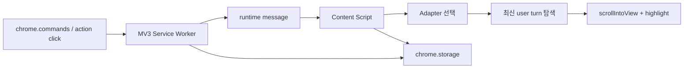
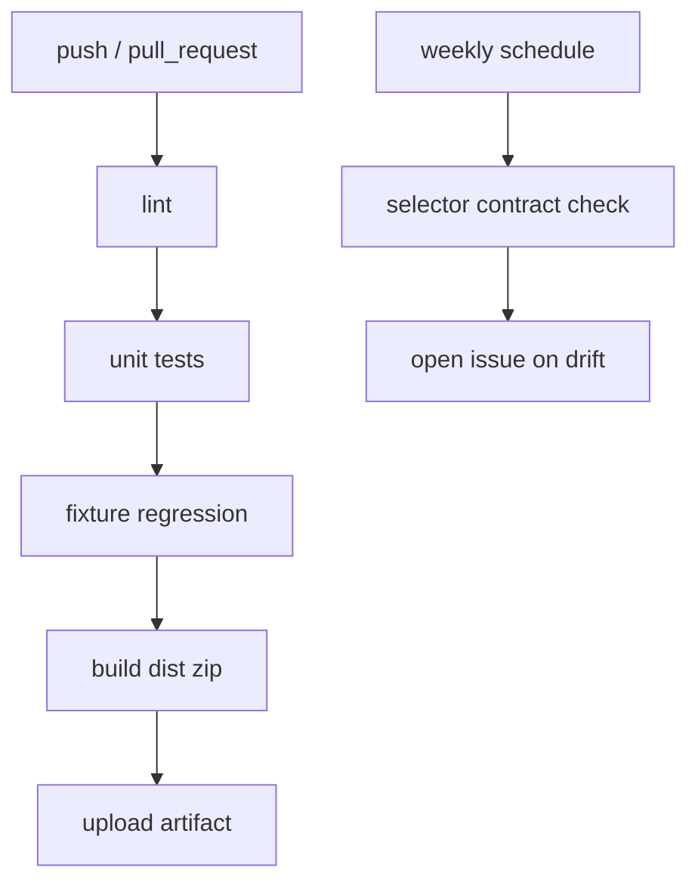

# AI Chat Jump Chrome Extension 개발 명세서
# Extension Title Name: ChatJumper

Markdown 버전은 본문이며, HTML 버전은 [ai-chat-jump-report.html](sandbox:/mnt/data/ai-chat-jump-report.html)이다.

## Executive Summary

이 프로젝트는 entity["software","ChatGPT","AI assistant web app"], entity["software","Gemini","AI assistant web app"], entity["software","Claude","AI assistant web app"]의 **긴 대화 화면 안에서 “내가 마지막으로 보낸 질문” 위치로 즉시 이동**시키는 초협소 utility로 정의하는 편이 맞다. 공개 도움말 기준으로 ChatGPT는 과거 대화 검색을 제공하고, Gemini는 recent/pinned chats와 채팅 검색을 제공하며, Claude는 past chat search를 지원하지만, **현재 열려 있는 한 대화 안에서 최신 사용자 turn으로 점프**하는 기능은 적어도 공개 문서상으로는 드러나지 않는다. 이 공백이 곧 AI Chat Jump의 명확한 제품 가치다. 또한 기능을 여기까지로 묶으면 Chrome Web Store의 **single-purpose** 요구와도 잘 맞는다. citeturn17search3turn31view0turn31view2turn16view2

스토어 출시까지 바라보면 설계는 **Manifest V3 + static content scripts + service worker + commands + local-first settings** 조합이 가장 단순하고 리뷰 친화적이다. MV3는 신규 제출 필수이고, content scripts는 DOM을 읽고 조작할 수 있으며, commands는 manifest에서 기본 단축키를 선언하도록 되어 있다. 테스트는 entity["software","Playwright","end-to-end testing framework"]가 Chromium persistent context에서 확장 로딩을 공식 지원하므로 가장 무난하고, CI는 repo 안의 YAML workflow로 운영하는 GitHub Actions 경로가 실무적으로 가장 빠르다. 이 제품의 핵심 리스크는 DOM 변경이므로, **사이트별 adapter + fallback heuristic + snapshot/fixture regression + 주간 selector 점검**을 최초 명세에 포함해야 한다. citeturn32view0turn14view0turn12view2turn13view0turn21view0turn12view13

## 목표와 범위

가정은 세 가지로 두는 것이 좋다. **대상은 Chrome 데스크톱만**, **지원 사이트는 로그인된 웹 세션 기준**, **서버 백엔드는 없다**다. 이렇게 두면 권한, 리뷰, 운영비, 프라이버시 문구가 모두 단순해진다. citeturn16view2turn12view4

| 구분 | 포함 기능 | 의도 |
|---|---|---|
| MVP | 최신 사용자 메시지로 점프, 단축키 실행, 플로팅 버튼, ChatGPT/Gemini/Claude 지원 | 제품 핵심가치 검증 |
| Phase A | 하이라이트 flash, 버튼 on/off, 실패 toast, 옵션 페이지 | UX 완성도 보강 |
| Phase B | ko/en locale, selector contract 테스트, CI artifact, 주간 점검 | 출시 안정화 |
| 제외 범위 | 채팅 export, 요약, 검색 대체, 서버 동기화, 계정 연동, analytics SDK | single-purpose 유지 |

MVP에서 export/sync/search/summarize를 빼는 이유는 단순하다. Chrome Web Store는 **단일 목적**을 요구하고, 권한은 **가장 좁게** 요청할수록 설치 전환과 리뷰 모두 유리하다. “점프”라는 핵심 기능 외의 부가 기능은 사용자에게도, 리뷰어에게도 완전히 다른 제품처럼 보일 수 있다. citeturn16view2turn12view4turn25view3

실제 제품 문장은 아래처럼 잡으면 된다.

- **문제 정의:** 긴 AI 대화에서 가장 최근 내 질문으로 다시 올라가는 비용이 크다.
- **사용자 페인포인트:** 답변이 길어질수록 스크롤 탐색이 반복되고, 현재 논점 복귀가 느리다.
- **성공 기준:** 한 번의 키 입력 또는 버튼 클릭으로 최신 user turn에 도달하고, 이동 직후 시각적 피드백이 보인다.

## 기술 스택과 아키텍처

권장 베이스는 entity["software","TypeScript","typed JavaScript language"] + entity["software","Vite","frontend build tool"] + entity["software","Playwright","end-to-end testing framework"] + GitHub Actions다. TypeScript는 adapter와 message contract를 안전하게 만들고, Vite는 빠른 dev server와 lean build를 제공하며, Playwright는 extension test fixture를 공식 문서로 제공한다. GitHub Actions는 Node 프로젝트의 build/test workflow를 repo 안에서 바로 관리하기 쉽다. citeturn11search7turn11search12turn21view0turn12view13

| 레이어 | 권장안 | 메모 |
|---|---|---|
| 언어 | TypeScript | adapter, message, DOM util 타입 고정 |
| 빌드 | Vite | MV3 번들 단순화, 빠른 로컬 반복 |
| 단위 테스트 | Vitest | selector scoring, visibility filter |
| E2E | Playwright | MV3 extension fixture, trace/report |
| 정적 검사 | ESLint + Prettier | 규칙 고정 |
| CI | GitHub Actions | push/PR/schedule 파이프라인 |
| 배포 | 초기엔 zip 수동 제출 | 리뷰 대응이 쉽다 |

아키텍처는 “**service worker는 이벤트 허브, content script는 DOM 실행기, adapter는 사이트별 규칙 묶음**”으로 자르는 게 맞다. content scripts는 페이지 DOM에 접근할 수 있지만 다른 확장 API 대부분은 직접 못 쓰고 runtime 메시징을 통해 다른 extension context와 통신해야 한다. service worker는 `background.service_worker`에 등록되며, global state에 의존하면 idle 종료 때 사라지므로 설정/상태는 storage로 넘겨야 한다. citeturn14view0turn14view1turn15view3



권장 파일 구조는 아래 정도면 충분하다.

```text
src/
  background/
    index.ts
  content/
    index.ts
    jump.ts
    injectButton.ts
  adapters/
    base.ts
    chatgpt.ts
    gemini.ts
    claude.ts
  shared/
    messages.ts
    dom.ts
    storage.ts
  options/
    index.html
    index.ts
tests/
  unit/
  fixtures/
  e2e/
```

MVP manifest는 가능한 한 작게 가져가야 한다. known hosts에 static content script를 붙이고, `storage`만 요청하며, 단축키는 commands에서 선언한다. `content_scripts.matches`도 사이트 접근 경고를 만들 수 있으므로, 여기서도 wildcard를 넓히지 않는 것이 중요하다. citeturn14view2turn25view3turn13view0

```json
{
  "manifest_version": 3,
  "name": "AI Chat Jump",
  "version": "0.1.0",
  "description": "Jump to the latest user question in ChatGPT, Gemini, and Claude.",
  "background": {
    "service_worker": "dist/background.js",
    "type": "module"
  },
  "permissions": ["storage"],
  "content_scripts": [
    {
      "matches": [
        "https://chatgpt.com/*",
        "https://gemini.google.com/*",
        "https://claude.ai/*"
      ],
      "js": ["dist/content.js"],
      "css": ["dist/content.css"],
      "run_at": "document_idle"
    }
  ],
  "commands": {
    "jump-to-latest-user-message": {
      "suggested_key": {
        "default": "Alt+J",
        "mac": "Command+J"
      },
      "description": "Jump to the latest user question"
    }
  },
  "icons": {
    "16": "icons/16.png",
    "48": "icons/48.png",
    "128": "icons/128.png"
  }
}
```

설정 저장은 두 가지 선택지가 있다. **`storage.local`**은 기기 로컬이고 용량이 더 넉넉하며, **`storage.sync`**는 Chrome sync가 켜진 브라우저 사이에 작은 설정을 동기화하는 데 적합하다. 이 확장은 채팅 원문을 저장하면 안 되므로, 저장 대상은 버튼 표시 여부·flash duration·도움말 dismiss 상태 정도로 제한하고, 프라이버시 보수적으로 가려면 첫 출시에는 `storage.local`로 시작하는 편이 안전하다. citeturn24view1turn24view2

## 플랫폼별 Adapter 설계

중요한 전제 하나를 먼저 박아두는 게 낫다. 아래 selector는 **서비스 공식 문서가 아니라 공개 오픈소스 구현과 브라우저 관찰값에 기반한 운영용 후보**다. 즉, “정답 selector”가 아니라 “릴리스 전 DevTools와 회귀 테스트로 확인해야 하는 1차 가설”이다. 공개 구현들 역시 공통적으로 DOM churn을 주요 리스크로 본다. citeturn27view0turn27view1turn27view2

| 플랫폼 | 루트 탐색 전략 | 우선 selector | fallback heuristic | 비고 |
|---|---|---|---|---|
| ChatGPT | `#thread` 우선, 없으면 `article` 계열 메인 컬럼 스캔 | `[data-message-author-role="user"]` | visible only, composer/overlay/popover 제외, 마지막 후보 선택 | 공개 구현들이 `#thread`, `[data-message-author-role]`, `article` 축을 공통 anchor로 쓴다. citeturn27view0turn27view1turn27view2 |
| Gemini | `#chat-history` 우선, hydration 후 재탐색 | `user-query-content` | `share-turn-viewer`, `message-content`, `response-container`, `model-response` 계열로 재시도 | 공개 구현들이 custom element 기반 selector를 공통으로 사용한다. hydration 지연 대응이 핵심이다. citeturn27view1turn27view2turn28search0 |
| Claude | `[data-test-render-count]` 주변 메인 대화 컬럼 | `[data-testid="user-message"]` | artifact/code pane 제외 후 visible text block 재점수화 | 공개 구현들이 `[data-testid="user-message"]`, `.font-claude-response`, `[data-test-render-count]` 부근을 anchor로 잡는다. citeturn27view0turn27view1turn27view2 |

실제 adapter는 selector 한 줄이 아니라 **탐색 파이프라인**으로 짜는 편이 덜 깨진다.

1. root 후보를 2~3개 준비한다.  
2. root 아래에서 user turn 후보를 수집한다.  
3. `offsetParent`, `getClientRects().length`, `innerText.trim().length`로 visible/text 유효 노드만 남긴다.  
4. `textarea`, `contenteditable`, sidebar, export drawer, artifact pane, code-only pane를 제거한다.  
5. 최종 후보가 없으면 **잘못 점프하지 말고 no-op + toast**로 끝낸다.

SPA 대응도 처음부터 넣어야 한다. 공개 구현들은 URL polling 또는 DOM mutation 관찰을 함께 사용하고, Gemini는 hydration 때문에 지연 재탐색이 들어간다. 이 프로젝트도 **`MutationObserver` + `location.href` diff + 150~300ms debounce**를 기본으로 하고, Gemini에만 **0ms / 1.5s / 3.0s 3-shot rescan**을 두는 구성이 안정적이다. citeturn27view0turn27view1

가장 중요한 운영 원칙은 이것이다. **“못 찾으면 안 움직이는 것”이 “틀린 메시지로 이동하는 것”보다 낫다.** 이 확장은 탐색 보조 도구라서, false positive가 한 번만 나와도 신뢰를 잃는다.

## 단축키·버튼 UX와 권한·프라이버시

권장 기본키는 **Windows/Linux `Alt+J`**, **macOS `Command+J`**다. 이유는 세 가지다. 첫째, commands API의 suggested key는 `Ctrl` 또는 `Alt`를 포함해야 하고 `Ctrl+Alt`는 금지다. 둘째, Chrome 자체가 Windows에서 `Ctrl+J`를 Downloads에 쓰므로 그대로 가져가면 충돌한다. 셋째, Gemini in Chrome은 이미 `Alt+G`/`Ctrl+G` 계열 shortcut을 쓰므로 G축을 피하는 편이 안전하다. macOS에선 Chrome Downloads가 `Command+Shift+J`라서 `Command+J`가 상대적으로 여유 있다. 사용자는 이후 `chrome://extensions/shortcuts`에서 직접 remap할 수 있다. citeturn13view2turn20search0turn16view7

| 플랫폼 | 권장 기본키 | 충돌 리스크 | 판단 |
|---|---|---|---|
| Windows/Linux | `Alt+U` | `Ctrl+U`는 Chrome Downloads와 충돌 | 가장 무난 |
| macOS | `Command+U` | `Command+Shift+U`가 Downloads, 사이트별 keydown 가로채기는 가능 | 기본값으로 적절 |
| ChromeOS | `Alt+U` | 일부 런처/IME 충돌 가능성 | remap 안내 전제 |

`commands` 예시는 아래 정도면 충분하다. suggested shortcut은 최대 4개까지 추천할 수 있고, OS/Chrome 고유 shortcut은 우선순위를 가진다. 따라서 “기본값은 적당히, remap은 사용자에게 맡기기”가 맞다. citeturn13view1turn13view4

```json
"commands": {
  "jump-to-latest-user-message": {
    "suggested_key": {
      "default": "Alt+J",
      "mac": "Command+J"
    },
    "description": "Jump to the latest user question"
  }
}
```

버튼 UX는 단순해야 한다. **우하단 fixed 44px 이상**, `aria-label="Jump to latest question"`, hover tooltip, 클릭 시 smooth scroll + 1.0~1.5초 highlight flash 정도면 충분하다. 시야를 가리지 않도록 composer와 겹칠 때는 약간 위로 띄우고, 모바일 레이아웃은 MVP에 넣지 않는 편이 낫다.

권한은 공격적으로 줄이는 게 맞다. MVP는 `storage`와 세 사이트의 `content_scripts.matches` 정도로 끝내고, **`tabs`/`scripting`/`activeTab`을 “미래를 위해” 미리 넣지 않는다.** Chrome 정책은 narrowest permissions를 요구하고, `host_permissions`와 `content_scripts.matches` 변경도 경고를 만들 수 있다. 이후 만약 programmatic injection이나 per-site runtime enable이 필요해지면 그때 `optional_host_permissions`와 `scripting`을 추가하면 된다. citeturn12view4turn25view3turn14view2

프라이버시 문구는 **local-only, no analytics, no server transfer**를 전면에 두면 된다. 다만 스토어 정책상 privacy disclosure는 정확해야 한다. Chrome 문서상 extension은 Privacy tab에 수집·처리 정보를 정확하게 적어야 하고, 사용자 데이터를 다루면 최신 privacy policy를 게시해야 한다. 2023년 변경 이후에는 extension별 privacy policy 제공도 요구된다. citeturn32view0turn12view5turn16view1turn30view0

> **개인정보 비전송 정책 초안**  
> AI Chat Jump는 지원 사이트의 현재 페이지 DOM에서 최신 사용자 메시지 위치를 찾고 브라우저 내 스크롤을 이동시키기 위해서만 동작합니다. 대화 내용은 개발자 서버로 전송·수집·판매하지 않으며, 광고 추적기와 원격 텔레메트리를 포함하지 않습니다. 저장이 필요한 경우 버튼 표시 여부와 같은 최소 설정만 브라우저 저장소에 보관합니다.

보안 측면에서는 **원격 selector 규칙 로딩도 1차 출시에서는 피하는 편**이 낫다. MV3는 원격 호스팅 코드(RHC)를 금지하고, store policy는 extension의 전체 동작이 제출된 코드에서 discernible해야 한다고 본다. selector JSON이 “데이터인지 로직인지” 회색지대에 걸릴 여지가 있으므로, 첫 스토어 버전은 **모든 selector map과 fallback 로직을 번들 안에 포함**시키는 쪽이 보수적이다. citeturn16view3turn29view0

## 테스트·CI·유지보수

테스트는 세 겹으로 나누는 것이 좋다. **unit**은 visibility/filter/scoring, **fixture regression**은 저장해 둔 DOM 조각에서 마지막 user turn을 찾는지, **manual smoke**는 실제 로그인 세션에서 click/shortcut/jump UX를 확인하는 층이다. Playwright는 MV3 extension 로딩을 persistent Chromium context로 공식 지원하고, auto-waiting과 trace viewer가 있어 DOM UI의 flaky test에 유리하다. citeturn21view0turn21view1turn21view3

| 계층 | 검증 내용 | 권장 도구 |
|---|---|---|
| Unit | selector scoring, visibility, artifact exclusion | Vitest |
| Fixture regression | 플랫폼별 저장 DOM 샘플에서 latest user turn 찾기 | Playwright 또는 jsdom |
| Extension smoke | 명령 → 메시지 전달 → jump/highlight end-to-end | Playwright |
| Live smoke | 실제 ChatGPT/Gemini/Claude 세션에서 클릭/단축키 검증 | 로컬 전용 dev profile |

공용 CI에는 로그인 자동화를 넣지 않는 편이 낫다. 대신 push/PR에서는 **lint + unit + fixture regression + build**, 주간 schedule에서는 **selector contract 재검사 + issue 생성**으로 나눈다. GitHub Actions의 scheduled workflow는 cron이 UTC 기준이고, 정시 근처는 지연될 수 있으므로 `03:17 UTC`처럼 어중간한 시각이 낫다. artifact 업로드는 기본 기능이지만, Playwright trace/HTML report에는 계정 정보나 테스트 데이터가 남을 수 있어 trusted artifact store만 써야 한다. citeturn22search0turn22search1turn22search2turn21view2



유지보수 전략은 단순하게 가야 한다.

- **`selector-contract.json`**: 플랫폼별 primary/fallback selector와 제외 규칙을 한곳에 둔다.
- **fixture 폴더**: 실제 UI에서 잘라낸 sanitized DOM 샘플을 버전별로 저장한다.
- **drift alert**: 주간 workflow가 contract failure 시 issue를 자동 생성한다.
- **runtime no-op**: 탐지 confidence가 낮으면 아무것도 하지 않고 lightweight toast만 보여 준다.

GitHub Actions에서 정기적으로 issue를 만드는 방식은 문서화되어 있고, GitHub CLI도 hosted runner에 기본 포함된다. 따라서 “selector drift → scheduled workflow 실패 → issue 생성” 루프를 구현하기 어렵지 않다. citeturn22search4turn22search11

## 출시 계획과 개발 일정

스토어 제출 체크리스트는 생각보다 기계적이다. developer account 등록과 **1회 등록비**, publisher/developer email 준비, zip 업로드, listing 정보, privacy fields, icon/screenshot 자산, test instructions가 핵심이다. zip 업로드 기반이고 최대 패키지 크기는 2GB다. citeturn12view7turn12view8turn32view0

누락되기 쉬운 포인트는 listing 자산이다. 스토어 문서상 **128x128 icon**이 zip 안에 필요하고, **최소 1장의 1280x800 screenshot**이 필요하며, 누락 시 reject될 수 있다. 이미지에는 일관된 브랜딩을 유지하고, 흐리거나 과한 텍스트를 피해야 한다. citeturn12view9turn12view10turn16view4turn16view6

카테고리는 **Functionality & UI**가 가장 자연스럽고, 대안은 **Tools**다. 제품명은 “AI Chat Jump”처럼 중립 브랜드를 전면에 두고, 설명에서 “Works with ChatGPT, Gemini, Claude”를 쓰는 편이 review risk가 낮다. listing은 기능을 과장하거나 현재 상태를 오해하게 만들면 안 된다. citeturn32view0turn16view6

현재 리스크도 하나 있다. Chrome 문서는 **2026년 4월 기준 제출 급증으로 review time이 길어지고 있다**고 명시한다. 따라서 “기능 구현 완료일”과 “스토어 공개일” 사이에 최소 1주는 buffer를 두는 쪽이 안전하다. citeturn16view5

| 주차 | 마일스톤 | 산출물 |
|---|---|---|
| Week 1 | 스캐폴드 + ChatGPT adapter | MV3 뼈대, commands, 버튼, 기본 점프 |
| Week 2 | Gemini + Claude adapter | 3개 사이트 지원, fallback, confidence rule |
| Week 3 | 테스트와 정책 | fixture regression, CI, privacy 문구, 옵션 페이지 |
| Week 4 | 스토어 패키징과 제출 | dist zip, screenshots, listing 문구, test instructions |

권장 아이콘/스크린샷 구성은 아래 정도면 충분하다.

| 자산 | 권장 구성 |
|---|---|
| 아이콘 | chat bubble + upward jump arrow, light/dark 배경 모두 인지 가능 |
| 스크린샷 1 | ChatGPT 긴 스레드에서 버튼 클릭 전/후 |
| 스크린샷 2 | 단축키 실행 후 최신 user turn highlight |
| 스크린샷 3 | Gemini 동일 UX |
| 스크린샷 4 | Claude 동일 UX |
| 스크린샷 5 | 옵션 페이지 + local-only/privacy-first 문구 |

스토어 설명 초안은 아래로 시작하면 된다.

> **스토어 설명 초안**  
> AI Chat Jump는 ChatGPT, Gemini, Claude의 긴 대화에서 최신 사용자 질문으로 즉시 이동해 주는 초경량 Chrome 확장입니다.  
> `Alt + J` 또는 `Command + J`, 혹은 화면의 점프 버튼으로 바로 이동할 수 있습니다.  
> 대화 내용은 외부 서버로 전송하지 않으며, 필요한 설정만 브라우저 저장소에 보관합니다.

LICENSE는 **MIT 기본**이 가장 무난하다. 설치 장벽이 낮고 토이 프로젝트에서 스토어 출시까지 이어가기 쉽다. 다만 기업 재사용과 특허 명시를 중시하면 Apache-2.0으로 바꾸는 선택지도 있다.

Placeholder로 남는 항목은 명확히 분리해 두면 된다. **developer contact email**, **최종 아이콘 원본 파일**, **실제 스토어 screenshots**, **public support email**, **privacy policy 게시 URL**은 아직 미제공 정보로 두면 충분하다.

## 개발 템플릿과 AI 협업

아래 TypeScript 예시는 MV3의 content script / runtime messaging / commands 구조를 그대로 따른 축약본이다. 핵심은 “background가 command를 받고, content script가 adapter를 통해 DOM을 찾고, 못 찾으면 no-op” 흐름이다. citeturn14view0turn12view2turn13view2

```ts
export interface ChatAdapter {
  readonly id: "chatgpt" | "gemini" | "claude";
  canHandle(url: URL): boolean;
  findLatestUserMessage(root: Document | HTMLElement): HTMLElement | null;
  getScrollContainer(root: Document | HTMLElement, target: HTMLElement): HTMLElement | Window;
}
```

```ts
export function jumpToLatestUserMessage(adapter: ChatAdapter) {
  const target = adapter.findLatestUserMessage(document);
  if (!target) {
    return { ok: false as const, reason: "NOT_FOUND" };
  }

  target.scrollIntoView({
    behavior: "smooth",
    block: "center",
    inline: "nearest",
  });

  target.classList.add("aicj-flash");
  window.setTimeout(() => target.classList.remove("aicj-flash"), 1200);

  return { ok: true as const, adapter: adapter.id };
}
```

```ts
chrome.commands.onCommand.addListener(async (command, tab) => {
  if (command !== "jump-to-latest-user-message") return;
  if (!tab?.id) return;

  await chrome.tabs.sendMessage(tab.id, {
    type: "JUMP_TO_LATEST_USER_MESSAGE",
  });
});
```

README는 과하게 길 필요 없다. 아래 템플릿이면 충분하다.

```md
# AI Chat Jump

Jump to the latest user question in ChatGPT, Gemini, and Claude.

## Features
- Keyboard shortcut
- Floating jump button
- Local-only processing
- No analytics / no cloud sync

## Supported sites
- chatgpt.com
- gemini.google.com
- claude.ai

## Install
1. npm ci
2. npm run build
3. chrome://extensions -> Load unpacked

## Privacy
This extension does not send conversation content to external servers.

## Development
- npm run dev
- npm run test
- npm run test:e2e

## Release checklist
- [ ] version bump
- [ ] dist zip
- [ ] screenshots
- [ ] privacy text
- [ ] manual smoke test
```

entity["software","GitHub Copilot","AI coding assistant"]나 entity["software","Codex","coding product"]와 협업할 때는 **작업을 작게 쪼개고**, 프롬프트에 **goal / context / boundaries / output format**을 분리해서 넣는 편이 낫다. Copilot 문서도 agent mode는 well-scoped task에 적합하다고 설명하고, 좋은 프롬프트는 구체적 목표·관련 배경·제약을 명시하라고 권한다. IDE 안에서는 관련 파일만 열고 불필요한 chat context를 걷어내는 것이 성능에 유리하다. reusable prompt file도 사용할 수 있다. citeturn23search10turn23search16turn23search1turn23search4turn23search5turn23search2

작업 분할은 아래 순서가 좋다.

| 순서 | Task |
|---|---|
| 1 | MV3 + TypeScript + Vite 스캐폴드 |
| 2 | 공통 adapter 인터페이스 + jump engine |
| 3 | ChatGPT adapter |
| 4 | Gemini adapter + hydration rescan |
| 5 | Claude adapter + artifact exclusion |
| 6 | floating button + accessibility |
| 7 | fixture regression + Playwright smoke |
| 8 | README, privacy text, store assets |

프롬프트 예시는 아래처럼 고정하면 된다.

```text
Task: Scaffold a Chrome Manifest V3 extension with TypeScript and Vite.
Goal:
- Single-purpose utility: jump to latest user question
Context:
- Target sites: chatgpt.com, gemini.google.com, claude.ai
Constraints:
- No remote hosted code
- Minimal permissions
- Static content_scripts
Output:
- file tree
- package.json scripts
- manifest.json
- background/content entrypoints
```

```text
Task: Implement a Gemini adapter.
Goal:
- Find the latest visible user turn reliably.
Context:
- Primary selector: user-query-content
- Fallbacks: share-turn-viewer, message-content, response-container
Constraints:
- Do not use brittle nth-child selectors.
- Ignore side panels / artifacts / export drawers.
- Return null if confidence is low.
Output:
- adapter code
- tests
- failure modes
```